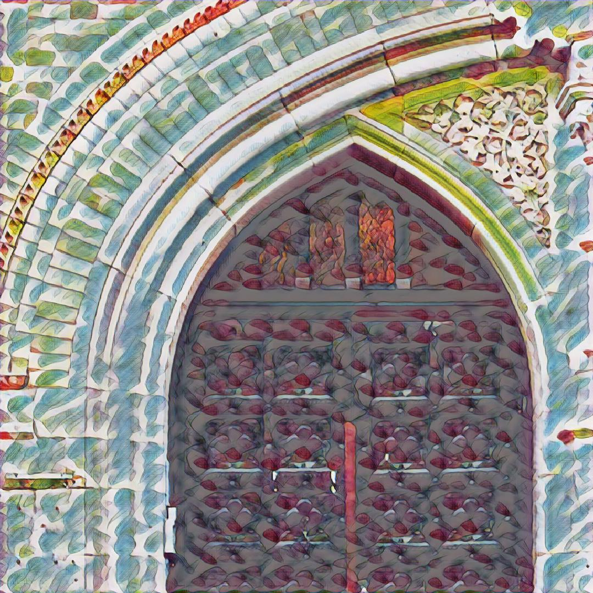

# My Pytorch Learn--fast style Transfer

a simple sample for fast style Transfer

## how to test

python genrate.py --image test.jpg --out_name style.jpg
## how to train 
mkdir data && cd data && mkdir image

move your train image in data/image/

move your style image in data

python train.py

## result

    
    

